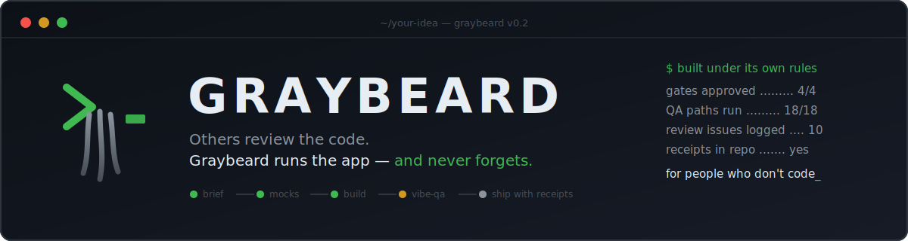

# 🧙 Graybeard

**The senior engineer for people who don't write code.**
*It briefs you before building, shows you clickable mocks before real code, runs your app like a stranger before saying "done," survives the AI's own memory wipes — and turns your painful sessions into permanent, tested rules.*

[](LICENSE)
[](../../releases)
[](https://claude.com/claude-code)
[](CONTRIBUTING.md)

You have ideas. AI can write the code. And yet your projects keep collapsing —
the AI says *"fixed!"* while the app stays broken, every fix breaks the thing
next to it, and the code becomes a black box you can't question.

**That's not your fault. Nobody gave the AI rules.**

Graybeard is a free plugin for [Claude Code](https://claude.com/claude-code)
that gives your AI the discipline of a seasoned engineering team — written in
plain language, personalized to you in a 10-minute interview, and (the part
nothing else has) **able to learn new rules from your own painful sessions,
with proof they work.**

**New in v0.2:** Graybeard now *runs your app like a stranger* before calling
it done (click-everything QA with Playwright evidence), and *survives the AI's
own memory wipes* (Context Guard — your project state lives in files that
outlast any session). Others review the code. **Graybeard runs the app — and
never forgets.**

---

## Side-by-side: the same broken button

| 🟥 Without Graybeard | 🟩 With Graybeard |
|---|---|
| **You:** the button still doesn't work<br>**AI:** Fixed! The issue was in the event handler. ✅<br>**You:** it's still broken<br>**AI:** You're right, I apologize! Fixed now. ✅<br>**You:** IT'S STILL BROKEN<br>*…repeat for 25 days. (This is the founder's true story.)* | **You:** the button still doesn't work<br>**AI:** Checking my notes — you reported this yesterday, so I won't ask you to re-explain. *[reads the app's own logs]* The click fires but the save call errors on line 3 of the log. Here's my **brief**: what's broken, the root cause with evidence, what I'll change, and what I'll re-test so the fix doesn't break the page next to it. Say "go".<br>**AI (later):** Done — **here are 2 steps so you can confirm it yourself. I already ran them; you're confirming, not discovering.** |

And the disease Vibe-QA (new in v0.2) exists to kill:

| 🟥 The AI grading its own homework | 🟩 Graybeard's Vibe-QA |
|---|---|
| "**All 47 tests pass!** ✅" — but the tests were written by the same AI that wrote the code, so they check what the code *does*, not what you *wanted*. The Save button is wired to nothing. The dashboard shows hard-coded sample data. Three links go nowhere. The tests can't see any of it. | Tests from the **outside in**, like a stranger: clicks every single button and logs *expected → actual* · proves each screen shows **live** data (search changes results; created data survives a reload) · walks every real user journey with Playwright · feeds every form garbage · then delivers an honest verdict: **"X% functional"** with a ranked fix list on a visual evidence page. "UNVERIFIED" is an acceptable answer; guessing is not. |

---

## What it does — five things

| | |
|---|---|
| 📜 **Proven working laws** | Habits like *brief me before you code*, *never say "done" without running it*, *fix the class of the bug, not just today's case*, *read the logs before guessing*. Shipped tested — each law was verified to actually change AI behavior before it got in. |
| 🪪 **Made yours in 10 minutes** | A short interview (7 questions, one at a time, each with a suggested answer) writes your personal standing orders and a gentle every-turn reminder. Your name lives in exactly one file you own. |
| 🔁 **The loop — it learns from your pain** | Point it at a session that made you angry. It finds the *underlying* disease, writes **one general rule** (never a case-patch), **proves the rule works** with a before/after test, shows you the evidence, and installs it. Your AI literally gets better from your own worst days. |
| 🧪 **Vibe-QA — it runs the app, not just the tests** *(new in v0.2)* | The reason AI apps "pass tests but stay broken": the AI that wrote the code also wrote the tests. Vibe-QA tests from the outside in — clicks every button, walks every real user journey with Playwright, feeds every form garbage, and proves the screen shows *live* data, not fakes. Works on **any** app — even ones built without Graybeard. |
| 🧠 **Context Guard — it survives memory wipes** *(new in v0.2)* | The AI's memory is a whiteboard that gets silently wiped when full ("compaction") — that's why it "forgets" fixes and re-asks settled questions. Context Guard checkpoints every decision to files on disk, injects preservation rules the instant before a wipe, and hands a new session its memory back automatically. You never re-explain a project again. |

You never need to know how programmers think. Graybeard thinks that way for you.

---

## Install (2 commands)

Inside Claude Code, type:

```
/plugin marketplace add vikas53953/graybeard
/plugin install graybeard@graybeard
```

Then restart Claude Code once so the plugin loads. Verify with `/plugin list` —
you should see **graybeard 0.2.0**.

> **On Windows, or if `/plugin marketplace add` shows nothing?** That command can
> silently no-op (a known Claude Code quirk). Confirm with `/plugin list` — if
> graybeard isn't listed, restart Claude Code fully, or see
> [`docs/how-it-works.md`](docs/how-it-works.md) for the settings-file method.

## Set it up

```
set up Graybeard
```

Plain English always works (the typed form is `/graybeard:onboard`). Seven short
questions, one at a time, each with a suggested answer — often you just say
"yes." The optional last question asks about *the last time an AI session made
you angry*, and turns that story into your very first personal rule.

Everything it writes is a file **you own and can read**: your profile, your
standing orders, and an every-turn reminder that keeps the AI from drifting.
Nothing is sent anywhere — no account, no server, no telemetry.

## Your first project

```
build me a simple page that tracks my daily water intake
```

Watch what changes:

- 📋 a short **brief** before any code — and it waits for your "go"
- 🖼️ approvals arrive as **visual pages** you open in a browser, never walls of text
- ❓ **one question at a time** when it's unsure, always with a recommendation
- 🗺️ for bigger ideas, a full **idea → product pipeline**: requirements you
  approve, clickable mock-ups before real code, a system-design page that shows
  every component *and the engineering principles applied*, and a scoreboard
  (`PIPELINE.md`) so a brand-new session resumes exactly where the last one stopped
- ✅ it refuses to say "done" until it has **run the thing and can prove it** —
  you confirm its evidence; you never discover its bugs

## The loop — turn a bad session into a permanent rule

```
learn from this painful session
```

(Typed form: `/graybeard:learn-from-pain`.) Point it at a saved transcript or
just describe what kept going wrong. Graybeard:

1. finds the **class-level disease** (not the surface symptom),
2. drafts **one general rule** — if the rule mentions your specific feature, it
   failed its own standard,
3. **tells you the small testing cost first** (you can decline and install
   untested, clearly flagged),
4. proves it: baseline runs *without* the rule fail, runs *with* it pass,
5. shows you the evidence on a visual page, and installs the rule.

And it's already becoming proactive: when a fix fails twice in a row (the
"two-strikes" moment), Graybeard offers the loop right there — pain is freshest
at the moment it happens.

## Test any app — even one you built without Graybeard

```
QA my app like a stranger would
```

(Typed form: `/graybeard:graybeard-vibe-qa`.) Nine gated phases, in order:
does it load → does every click do something real → is the data live or fake
(the **wire-up audit** — the #1 disease of AI-built apps) → full Playwright
user journeys → garbage-input testing → UI review → hygiene audit (leaked
secrets, phantom features) → regression → an honest final report:
**"X% functional"** with a ranked fix list, delivered as a visual evidence
page. It never grades its own homework: every verdict comes with pasted real
output, and "UNVERIFIED" is always an acceptable answer — guessing never is.

Got an app from a 3-day vibe-coding spree that "works on the happy path"?
Point Vibe-QA at it. That's the fastest way to see what Graybeard is about.

## Never lose work to a memory wipe again

Your AI's working memory is a fixed-size whiteboard. When it fills, the tool
silently photographs it, wipes it, and keeps only a short summary — everything
else is **gone**. That's the real cause of "we fixed this yesterday, why is it
broken again?"

Context Guard fixes it with ops discipline, automatically:

- **checkpoints** every decision, file role, and test result to `HANDOFF.md`
  at every natural boundary — files survive; whiteboards don't
- a **tripwire fires the instant before a wipe**, forcing the summary to keep
  decisions *with their reasons* — and logs the wipe to
  `.graybeard/context-events.log` so you have evidence it happened
- when any **new session starts**, it reads `HANDOFF.md` + `PIPELINE.md` off
  disk and resumes with one line: *"Picking up from HANDOFF.md — next step: X."*

You never re-explain your project. Plain-words deep dive:
[`docs/context-guard-how-it-works.md`](docs/context-guard-how-it-works.md).

> The two tripwires need Python 3 on your machine (most do; type
> `python --version` to check). No Python? Everything still works in
> discipline-only mode — the AI checkpoints by law instead of by tripwire.

## Remove it anytime — leaves no trace

```
remove Graybeard
```

(Typed form: `/graybeard:graybeard-uninstall`.) Every file it added is removed;
every file it touched is restored from the backup it took first. It keeps a
manifest of everything it changed, so removal is exact — this is tested to the
byte.

---

## 🔍 The receipts — this repo contains its own birth certificate

Graybeard was built by a network engineer who cannot write code, using Claude —
**under Graybeard's own rules.** Every gate of its development is in this repo,
unedited:

| Stage | Evidence |
|---|---|
| Requirements the owner approved | [`docs/gates/gate1-requirements.html`](docs/gates/gate1-requirements.html) |
| Clickable mocks before any code | [`docs/gates/gate2-mocks.html`](docs/gates/gate2-mocks.html) |
| System design & build plan | [`docs/gates/gate3-plan.html`](docs/gates/gate3-plan.html) |
| Code review: 10 issues found, honestly logged | [`docs/gates/stage6-review.html`](docs/gates/stage6-review.html) |
| QA: 18/18 paths run, not read | [`docs/gates/stage7-qa.html`](docs/gates/stage7-qa.html) |
| The ship decision itself | [`docs/gates/gate4-ship.html`](docs/gates/gate4-ship.html) |
| Every deviation from the plan | [`implementation-notes.md`](implementation-notes.md) |

We think every AI-built project should ship its receipts. This one starts.

## How it compares — honestly

| | 🧙 Graybeard | [compound-engineering](https://github.com/EveryInc/compound-engineering-plugin) | [mattpocock/skills](https://github.com/mattpocock/skills) | [gstack](https://github.com/garrytan/gstack) |
|---|---|---|---|---|
| Built for | **non-coders** who review outcomes | engineers | engineers | founders/PMs |
| Human approval gates with **visual pages** | ✅ 4 hard gates | plan review | PRD review | decision briefs |
| Runs the app outside-in (click-everything, wire-up audit, Playwright) | ✅ Vibe-QA | code review | QA plan for humans | click-everything QA |
| Survives context wipes **automatically** (pre-wipe tripwire + auto-resume) | ✅ Context Guard | plan files (manual) | issues/handoff (manual) | ❌ |
| Learns new rules from your bad sessions **with before/after proof** | ✅ the loop | docs learnings | ❌ | ❌ |
| Ships its own build receipts in the repo | ✅ every gate | ❌ | ❌ | ❌ |

These are mature projects we admire and credit — the table is about *fit*, not
ranking. If you read code fluently, they may serve you better.

## Honest positioning — is Graybeard for you?

If you **read code fluently**, you may be happier with
[compound-engineering](https://github.com/EveryInc/compound-engineering-plugin),
[gstack](https://github.com/garrytan/gstack), or
[mattpocock/skills](https://github.com/mattpocock/skills) — mature,
engineer-first systems we admire (and credit below). Graybeard is for the rest
of us: domain experts, founders, and builders who review *outcomes*, not diffs.
Two ideas here are worth stealing at any skill level, though: **the loop** (no
other tool turns your failures into tested rules automatically) and **the
outside-in pair** — others review the code; Graybeard *runs the app* (Vibe-QA)
and *survives the memory wipes* that quietly derail every long AI session
(Context Guard).

## What's inside (plain-words map)

| Piece | What it is | Say (or type) |
|---|---|---|
| 🛠️ Work Law | day-to-day habits for fixes and small builds | *automatic* |
| 🔦 Unknowns Law | clears up fuzzy requests before building | *automatic* |
| 🎼 Conductor | the idea → product pipeline with checkpoints | *automatic* |
| 🪪 Setup interview | makes the laws yours | "set up Graybeard" · `/graybeard:onboard` |
| 🔁 The loop | turns bad sessions into tested rules | "learn from this session" · `/graybeard:learn-from-pain` |
| 🧪 Vibe-QA | click-everything QA for any AI-built app | "QA my app" · `/graybeard:graybeard-vibe-qa` |
| 🧠 Context Guard | survives memory wipes; auto-resume from files | *automatic* |
| 🧹 Clean removal | puts your machine back exactly | "remove Graybeard" · `/graybeard:graybeard-uninstall` |

Work Law, Unknowns, Conductor, and Context Guard trigger themselves when they fit what you're doing — you never
call them by name. Full story: [`docs/how-it-works.md`](docs/how-it-works.md).

## Roadmap

- ✅ **v0.2 — shipped:** Vibe-QA (click-everything testing for AI-built apps)
  and Context Guard (automatic survival of memory wipes).
- **v0.3 — the automatic loop:** learn-from-pain fires itself at the pain moment
  (with guardrails: checks your existing rules first, caps active laws to
  prevent rule-sprawl, and never installs without your nod). Context Guard's
  wipe log becomes an input: repeated post-wipe failures are pain evidence.
- **Community laws:** export/import rules *with their test evidence attached*.
- Have an idea born from your own painful session? That's exactly the point —
  [open an issue](../../issues).

## Early adopters — this table is waiting for you

Nobody yet — this row could be you. Shipping Graybeard in a project, running it
on your builds, or porting an idea (the loop, Vibe-QA, Context Guard) into your
own tool? [Open an issue](../../issues) or a PR and we'll list you here with a
link, ADHD-repo style:

| Project / person | What they did | Status |
|---|---|---|
| *(your project)* | *(what you built or ported — MIT, attribution appreciated)* | |

## Community

- 🐛 **Your painful session is a feature request.** The loop exists to turn bad
  sessions into tested rules — [tell us about yours](../../issues), and it may
  become a law that ships to everyone.
- 💬 Questions, show-and-tell, law ideas → [Discussions](../../discussions).
- ⭐ If Graybeard saved you from one "it's fixed!" lie, a star is how the next
  non-coder finds it.

## Credits

Graybeard stands on ideas from people we admire:
[Thariq Shihipar](https://x.com/trq212)'s *Field Guide to Fable* (finding your
unknowns), [Garry Tan's gstack](https://github.com/garrytan/gstack)
(plain-English decision briefs, click-everything QA),
[Matt Pocock's skills](https://github.com/mattpocock/skills) (one-question
grilling, checkable completion), and
[Every's compound-engineering](https://github.com/EveryInc/compound-engineering-plugin)
(the one-plan-file pipeline). The synthesis, the plain-language layer, and the
loop are ours; the shoulders are theirs.

## License

[MIT](LICENSE) — free to use, change, and share.
